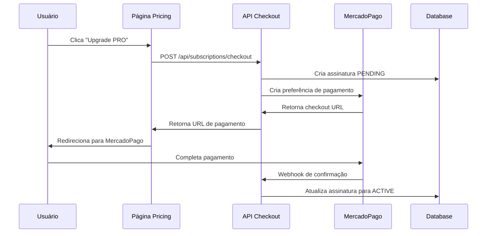

# Sistema de Pagamentos - ETF Curator

## Visão Geral

O ETF Curator utiliza o **MercadoPago** como gateway de pagamento para processar assinaturas dos planos PRO, WEALTH e OFFSHORE. Este documento detalha a implementação, configuração e resolução de problemas.

## Arquitetura

### Componentes Principais

1. **MercadoPagoService** (`src/lib/payments/mercadopago.ts`)
   - Classe responsável pela integração com a API do MercadoPago
   - Criação de preferências de pagamento
   - Configuração de URLs de retorno

2. **API de Checkout** (`src/app/api/subscriptions/checkout/route.ts`)
   - Endpoint para processar upgrades de planos
   - Validação de dados do usuário
   - Criação de assinaturas no banco de dados

3. **Página de Pricing** (`src/app/pricing/page.tsx`)
   - Interface para seleção e upgrade de planos
   - Integração com sistema de autenticação

## Configuração

### Variáveis de Ambiente

```env
# MercadoPago - Credenciais de Produção
MERCADOPAGO_ACCESS_TOKEN=APP_USR-xxxxxxxx-xxxx-xxxx-xxxx-xxxxxxxxxxxx-xxxxxx
NEXT_PUBLIC_MERCADOPAGO_PUBLIC_KEY=APP_USR-xxxxxxxx-xxxx-xxxx-xxxx-xxxxxxxxxxxx
MERCADOPAGO_CLIENT_ID=xxxxxxxxxxxxxxx
MERCADOPAGO_CLIENT_SECRET=xxxxxxxxxxxxxxxxxxxxxxxxxxxxxxx

# URL da aplicação
NEXT_PUBLIC_APP_URL=http://localhost:3000
```

### Planos Disponíveis

| Plano | Preço | Tipo | Características |
|-------|-------|------|----------------|
| STARTER | Gratuito | free | Funcionalidades básicas |
| PRO | R$ 39,90/mês | monthly | Acesso completo + IA |
| WEALTH | 1.5% a.a. | fee_based | Consultoria personalizada |
| OFFSHORE | 2.0% a.a. | fee_based | Aconselhamento internacional |

## Fluxo de Pagamento

### 1. Upgrade de Plano



### 2. Tipos de Resposta

- **immediate**: Planos gratuitos (ativação imediata)
- **contact**: Planos que requerem contato (WEALTH, OFFSHORE)
- **payment**: Planos pagos (redirecionamento para checkout)

## Implementação

### Classe MercadoPagoService

```typescript
class MercadoPagoService {
  private client: MercadoPagoConfig;
  private preference: Preference;

  constructor() {
    // Configuração robusta com fallbacks
    const accessToken = getEnvVariable('MERCADOPAGO_ACCESS_TOKEN');
    
    this.client = new MercadoPagoConfig({
      accessToken: accessToken,
      options: {
        timeout: 10000,
        idempotencyKey: `etf-curator-${Date.now()}`
      }
    });
  }

  async createPaymentPreference(data: CreatePreferenceData) {
    // Criação de preferência sem auto_return
    const preferenceData = {
      items: data.items,
      payer: data.payer,
      back_urls: data.back_urls,
      payment_methods: { installments: 12 },
      notification_url: `${appUrl}/api/webhooks/mercadopago`,
      external_reference: data.external_reference
    };

    return await this.preference.create({ body: preferenceData });
  }
}
```

### API de Checkout

```typescript
export async function POST(request: Request) {
  try {
    const { planId, userId, userEmail } = await request.json();
    
    // Validação de dados
    const plan = PLANS[planId.toLowerCase()];
    if (!plan) throw new Error('Plano inválido');

    // Criação da assinatura
    const subscription = await createSubscription(userId, plan);
    
    // Processamento baseado no tipo de plano
    switch (plan.type) {
      case 'free':
        return handleFreeUpgrade(subscription);
      case 'paid':
        return handlePaidUpgrade(subscription, plan, userEmail);
      case 'contact':
        return handleContactUpgrade(subscription);
    }
  } catch (error) {
    return handleError(error);
  }
}
```

## Resolução de Problemas

### Problemas Conhecidos e Soluções

#### ❌ Erro 503: "Serviço de pagamento temporariamente indisponível"

**Causa**: Configuração incorreta na API do MercadoPago

**Solução**:
1. **Remover campo `auto_return`** da preferência de pagamento
2. **Verificar variáveis de ambiente** estão carregadas
3. **Validar URLs de retorno** estão corretas

```typescript
// ❌ INCORRETO - Causa erro 503
const preferenceData = {
  items: [...],
  auto_return: 'approved' // Remove este campo
};

// ✅ CORRETO
const preferenceData = {
  items: [...],
  back_urls: {
    success: `${appUrl}/dashboard?payment=success`,
    failure: `${appUrl}/pricing?payment=failed`,
    pending: `${appUrl}/dashboard?payment=pending`
  }
};
```

#### ❌ Variáveis de ambiente não carregadas

**Causa**: Arquivo `.env.local` mal configurado

**Solução**:
1. Verificar formato das variáveis
2. Reiniciar servidor Next.js
3. Usar função `getEnvVariable()` robusta

```typescript
function getEnvVariable(key: string): string | undefined {
  return process.env[key] || 
         (typeof window === 'undefined' ? process.env[key] : undefined);
}
```

#### ❌ Inconsistência de preços

**Causa**: Preços diferentes entre configurações

**Solução**:
1. Manter preços consistentes em todos os arquivos
2. Usar configuração centralizada em `types/subscriptions.ts`

### Logs de Debug

Para debug, adicione logs na classe MercadoPago:

```typescript
console.log('🔍 Variáveis de ambiente MercadoPago:');
console.log('   - Access Token:', accessToken ? `${accessToken.substring(0, 20)}...` : 'UNDEFINED');
console.log('   - Public Key:', publicKey ? `${publicKey.substring(0, 20)}...` : 'UNDEFINED');
```

## Testes

### Teste Manual

1. **Página de teste**: `http://localhost:3000/test-upgrade-final.html`
2. **Página de pricing**: `http://localhost:3000/pricing`

### Teste Automatizado

```bash
# Teste via API
curl -X POST http://localhost:3000/api/subscriptions/checkout \
  -H "Content-Type: application/json" \
  -d '{
    "planId": "PRO",
    "userId": "test-user-id",
    "userEmail": "test@example.com",
    "userName": "Test User"
  }'
```

### Validação de Sucesso

✅ **Resposta esperada**:
```json
{
  "success": true,
  "type": "payment",
  "message": "Redirecionando para pagamento...",
  "checkoutUrl": "https://www.mercadopago.com.br/checkout/v1/redirect?pref_id=..."
}
```

## Webhooks

### Configuração

URL de webhook: `/api/webhooks/mercadopago`

### Eventos Processados

- `payment.created`: Pagamento criado
- `payment.approved`: Pagamento aprovado
- `payment.rejected`: Pagamento rejeitado

## Monitoramento

### Health Check

Endpoint: `/api/health`

Verifica:
- ✅ Variáveis de ambiente MercadoPago
- ✅ Conectividade com banco de dados
- ✅ Status geral da aplicação

### Métricas Importantes

- Taxa de conversão de upgrades
- Tempo de resposta da API de checkout
- Erros de integração MercadoPago

## Ambiente de Produção

### Deploy na Vercel

1. **Configurar variáveis de ambiente** no painel da Vercel
2. **Atualizar NEXT_PUBLIC_APP_URL** para URL de produção
3. **Configurar webhooks** para URL de produção

### Segurança

- ✅ Tokens de produção configurados
- ✅ Validação de origem nos webhooks
- ✅ Logs de auditoria implementados

## Suporte

### Contatos Úteis

- **MercadoPago Support**: [developers.mercadopago.com](https://developers.mercadopago.com)
- **Documentação API**: [MercadoPago API Reference](https://www.mercadopago.com.br/developers/pt/reference)

### Logs de Erro

Todos os erros são logados com contexto detalhado:

```typescript
console.error('❌ Erro ao criar preferência no Mercado Pago:', {
  error: error.message,
  userId,
  planId,
  timestamp: new Date().toISOString()
});
```

---

**Última atualização**: Janeiro 2025
**Versão**: 1.0
**Status**: ✅ Funcionando 