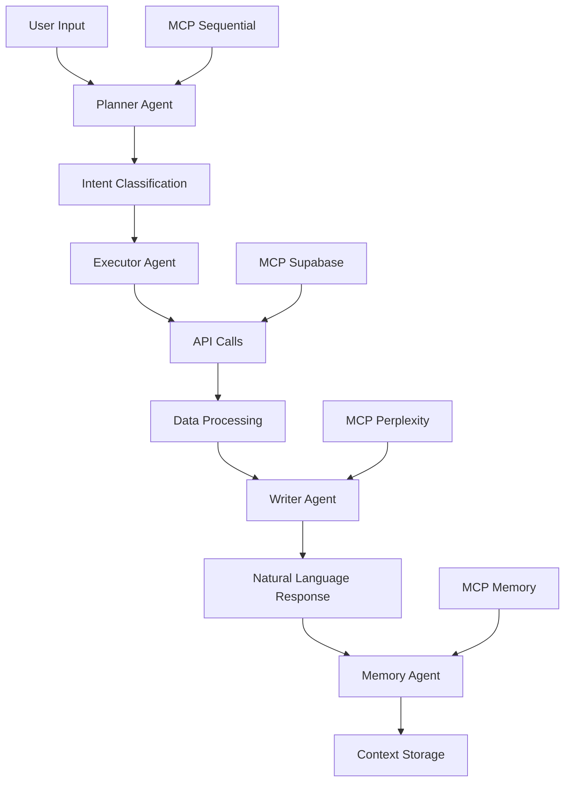

# 🤖 UPGRADE IA VERTICAL - ETF Curator

## 📌 VISÃO GERAL

Este documento especifica a implementação de um agente de IA vertical no ETF Curator utilizando o framework AutoGen, com interface conversacional estilo GPT/Perplexity. O agente será capaz de entender comandos em linguagem natural, executar funcionalidades internas da aplicação e retornar resultados contextualizados.

### 🎯 Objetivos Principais

- **Interface Conversacional**: Chat intuitivo para interação com todas as funcionalidades
- **Execução Inteligente**: Acesso a APIs internas via comandos de linguagem natural
- **Memória Contextual**: Histórico de conversas e projetos salvos
- **Raciocínio Multi-Etapa**: Análises complexas usando MCP Sequential
- **Integração Total**: Aproveitar toda a infraestrutura existente do ETF Curator

---

## 🏗️ ARQUITETURA ATUAL - ANÁLISE DE VIABILIDADE

### ✅ Recursos Disponíveis

**Base de Dados Rica (Supabase)**
- 1.370 ETFs ativos com métricas completas
- Tabelas: `etfs_ativos_reais`, `user_portfolio_allocations`, `portfolio_tracking`
- Métricas: retornos, volatilidade, Sharpe ratio, dividendos, drawdown

**APIs Robustas Existentes**
```typescript
// Portfolio APIs
/api/portfolio/unified-master       // Otimização Markowitz
/api/portfolio/unified-recommendations
/api/portfolio/save                 // Persistência de carteiras
/api/portfolio/real-data           // Tracking real vs simulado
/api/portfolio/performance
/api/portfolio/backtest

// ETF APIs  
/api/etfs/screener                 // Filtros avançados
/api/etfs/rankings                 // Rankings dinâmicos
/api/etfs/details/[symbol]         // Detalhes específicos
/api/etfs/comparator              // Comparação lado a lado
```

**Componentes Frontend Reutilizáveis**
- `UnifiedPortfolioMaster.tsx` - Criação de carteiras
- `AdvancedRecommendations.tsx` - Sistema de recomendações
- `ETFTable.tsx` - Visualização de dados
- `PerformanceChart.tsx` - Gráficos de performance

**MCPs Integrados**
- ✅ MCP Supabase - Acesso direto ao banco
- ✅ MCP Memory - Gestão de contexto
- ✅ MCP Sequential - Raciocínio multi-etapa
- ✅ MCP Perplexity - Pesquisa web complementar

---

## 🤖 ARQUITETURA DO AGENTE IA

### 🧠 Sistema Multi-Agente (AutoGen)



### 🔹 Planner Agent

**Responsabilidades:**
- Análise de intenção do usuário via NLP
- Classificação de comandos em categorias de ação
- Definição de pipeline de execução
- Uso do MCP Sequential para decisões complexas

**Classificações de Intent:**
```typescript
enum UserIntent {
  PORTFOLIO_OPTIMIZATION = 'optimize_portfolio',
  ETF_SCREENING = 'screen_etfs', 
  ETF_COMPARISON = 'compare_etfs',
  MARKET_ANALYSIS = 'analyze_market',
  EDUCATIONAL = 'explain_concept',
  PROJECT_MANAGEMENT = 'manage_project'
}
```

**Exemplo de Implementação:**
```typescript
class PlannerAgent {
  async analyzeIntent(message: string): Promise<ExecutionPlan> {
    const analysis = await this.mcpSequential.analyze({
      input: message,
      context: await this.mcpMemory.getRecentContext(),
      steps: [
        'extract_keywords',
        'classify_intent', 
        'identify_parameters',
        'plan_execution'
      ]
    });
    
    return {
      intent: analysis.intent,
      parameters: analysis.parameters,
      executionSteps: analysis.steps,
      requiredAPIs: this.mapIntentToAPIs(analysis.intent)
    };
  }
}
```

### 🔹 Executor Agent

**Responsabilidades:**
- Execução de chamadas para APIs internas
- Validação de parâmetros e segurança
- Processamento de dados retornados
- Tratamento de erros e fallbacks

**Mapeamento de Funcionalidades:**
```typescript
const API_MAPPINGS = {
  optimize_portfolio: {
    endpoint: '/api/portfolio/unified-master',
    requiredParams: ['objective', 'riskProfile', 'investment'],
    optionalParams: ['currency', 'constraints']
  },
  screen_etfs: {
    endpoint: '/api/etfs/screener', 
    requiredParams: ['filters'],
    optionalParams: ['sortBy', 'limit']
  },
  compare_etfs: {
    endpoint: '/api/etfs/comparator',
    requiredParams: ['symbols'],
    optionalParams: ['metrics']
  },
  analyze_rankings: {
    endpoint: '/api/etfs/rankings',
    requiredParams: ['category'],
    optionalParams: ['limit']
  }
};
```

**Implementação com Segurança:**
```typescript
class ExecutorAgent {
  async executeAPI(plan: ExecutionPlan, userContext: UserContext): Promise<APIResult> {
    // Validação de permissões
    if (!this.validateUserPermissions(userContext, plan.intent)) {
      throw new Error('Insufficient permissions');
    }
    
    // Sanitização de parâmetros
    const sanitizedParams = this.sanitizeParameters(plan.parameters);
    
    // Execução com retry e timeout
    const result = await this.withRetry(async () => {
      return await fetch(plan.endpoint, {
        method: 'POST',
        headers: this.getAuthHeaders(userContext),
        body: JSON.stringify(sanitizedParams),
        timeout: 30000
      });
    });
    
    return this.processAPIResponse(result);
  }
}
```

### 🔹 Writer Agent

**Responsabilidades:**
- Formatação de respostas em linguagem natural
- Explicações didáticas de conceitos financeiros
- Integração com pesquisa web (Perplexity)
- Geração de relatórios estruturados

**Capacidades de Escrita:**
```typescript
class WriterAgent {
  async formatResponse(data: APIResult, intent: UserIntent): Promise<string> {
    const templates = {
      portfolio_optimization: this.generatePortfolioReport,
      etf_screening: this.generateScreeningReport,
      market_analysis: this.generateMarketInsights,
      educational: this.generateEducationalContent
    };
    
    let response = await templates[intent](data);
    
    // Enriquecimento com dados externos se necessário
    if (this.needsExternalData(intent)) {
      const externalData = await this.mcpPerplexity.search({
        query: this.generateSearchQuery(data),
        limit: 3
      });
      response = this.enrichWithExternalData(response, externalData);
    }
    
    return response;
  }
  
  private generatePortfolioReport(data: PortfolioResult): string {
    return `
## 📊 Análise de Carteira Otimizada

**Perfil de Risco:** ${data.riskProfile}
**Objetivo:** ${data.objective}
**Investimento:** ${formatCurrency(data.investment)}

### 🎯 Composição Recomendada:
${data.allocations.map(etf => 
  `- **${etf.symbol}** (${etf.percentage}%): ${etf.name}
    - Taxa: ${etf.expenseRatio}% a.a.
    - Retorno 12m: ${etf.returns12m}%
    - Volatilidade: ${etf.volatility}%`
).join('\n')}

### 📈 Métricas Esperadas:
- **Retorno Esperado:** ${data.expectedReturn}% a.a.
- **Volatilidade:** ${data.expectedVolatility}%
- **Sharpe Ratio:** ${data.sharpeRatio}
- **Máximo Drawdown:** ${data.maxDrawdown}%

### 💡 Justificativa:
${this.generateJustification(data)}
    `;
  }
}
```

### 🔹 Memory Agent

**Responsabilidades:**
- Armazenamento de contexto de conversas
- Gestão de projetos salvos
- Recuperação de histórico relevante
- Análise de padrões de uso

**Estrutura de Dados:**
```typescript
interface ConversationContext {
  sessionId: string;
  userId: string;
  timestamp: Date;
  messages: Message[];
  extractedEntities: Entity[];
  userPreferences: UserPreferences;
  projectsReferenced: string[];
}

interface SavedProject {
  id: string;
  name: string;
  type: 'portfolio' | 'analysis' | 'strategy';
  data: any;
  createdAt: Date;
  lastAccessed: Date;
  tags: string[];
}
```

**Implementação:**
```typescript
class MemoryAgent {
  async saveConversation(context: ConversationContext): Promise<void> {
    // Salvar no MCP Memory para busca semântica
    await this.mcpMemory.createEntities([{
      name: `conversation_${context.sessionId}`,
      entityType: 'conversation',
      observations: [
        `User discussed ${context.extractedEntities.join(', ')}`,
        `Session duration: ${context.duration}`,
        `Intent: ${context.primaryIntent}`
      ]
    }]);
    
    // Salvar detalhes no Supabase
    await this.supabase
      .from('user_conversations')
      .insert({
        session_id: context.sessionId,
        user_id: context.userId,
        data: context,
        created_at: new Date()
      });
  }
  
  async getRelevantContext(userId: string, currentMessage: string): Promise<Context> {
    // Busca semântica no MCP Memory
    const semanticResults = await this.mcpMemory.searchNodes({
      query: currentMessage
    });
    
    // Contexto recente do Supabase
    const recentContext = await this.supabase
      .from('user_conversations')
      .select('*')
      .eq('user_id', userId)
      .order('created_at', { ascending: false })
      .limit(5);
    
    return this.mergeContextSources(semanticResults, recentContext);
  }
}
```

---

## 🔄 FLUXOS DE TRABALHO

### 📝 Exemplo 1: Otimização de Carteira

**Input do Usuário:**
> "Quero uma carteira conservadora para aposentadoria com R$ 50.000, focada em dividendos e baixo risco"

**Fluxo de Execução:**
```typescript
// 1. Planner Agent
const plan = await plannerAgent.analyzeIntent(userMessage);
// Result: {
//   intent: 'optimize_portfolio',
//   parameters: {
//     objective: 'retirement',
//     riskProfile: 'conservative', 
//     investment: 50000,
//     currency: 'BRL',
//     focus: 'dividends'
//   }
// }

// 2. Executor Agent
const portfolioResult = await executorAgent.executeAPI(plan, userContext);
// Chama: POST /api/portfolio/unified-master

// 3. Writer Agent
const response = await writerAgent.formatResponse(portfolioResult, plan.intent);

// 4. Memory Agent
await memoryAgent.saveConversation({
  sessionId: currentSession.id,
  intent: plan.intent,
  result: portfolioResult,
  userSatisfaction: 'pending'
});
```

**Output Esperado:**
```markdown
## 🎯 Carteira Conservadora para Aposentadoria

Baseado no seu perfil conservador e foco em dividendos, criei uma carteira otimizada:

### 📊 Composição Recomendada:
- **VYM** (35%): Vanguard High Dividend Yield ETF
  - Taxa: 0.06% a.a. | Dividend Yield: 2.8% | Volatilidade: 14%
- **SCHD** (25%): Schwab US Dividend Equity ETF  
  - Taxa: 0.06% a.a. | Dividend Yield: 3.2% | Volatilidade: 16%
- **BND** (25%): Vanguard Total Bond Market ETF
  - Taxa: 0.03% a.a. | Yield: 4.1% | Volatilidade: 6%
- **VXUS** (15%): Vanguard Total International Stock ETF
  - Taxa: 0.08% a.a. | Dividend Yield: 2.1% | Volatilidade: 18%

### 📈 Métricas da Carteira:
- **Retorno Esperado:** 7.2% a.a.
- **Dividend Yield:** 2.9% a.a.
- **Volatilidade:** 11.8%
- **Sharpe Ratio:** 0.61

### 💡 Por que essa composição?
Esta carteira prioriza **estabilidade e renda** através de ETFs de dividendos de alta qualidade (VYM, SCHD) e bonds (BND) para reduzir volatilidade. A exposição internacional (VXUS) oferece diversificação geográfica mantendo o perfil conservador.

**Próximos passos:** Posso simular o crescimento dessa carteira ao longo de 20 anos ou ajustar as alocações conforme suas preferências.
```

### 📝 Exemplo 2: Screening de ETFs

**Input do Usuário:**
> "Encontre ETFs de tecnologia com baixa taxa de administração e boa performance nos últimos 2 anos"

**Fluxo de Execução:**
```typescript
// 1. Planner Agent
const plan = await plannerAgent.analyzeIntent(userMessage);
// Result: {
//   intent: 'screen_etfs',
//   parameters: {
//     sector: 'technology',
//     maxExpenseRatio: 0.5,
//     minReturns24m: 10,
//     sortBy: 'returns_24m',
//     limit: 10
//   }
// }

// 2. Executor Agent  
const screeningResult = await executorAgent.executeAPI(plan, userContext);
// Chama: POST /api/etfs/screener

// 3. Writer Agent com pesquisa complementar
const marketContext = await mcpPerplexity.search({
  query: "technology ETF performance trends 2024",
  limit: 2
});

const response = await writerAgent.formatResponse(screeningResult, plan.intent, marketContext);
```

**Output Esperado:**
```markdown
## 🔍 ETFs de Tecnologia - Screening Otimizado

Encontrei **8 ETFs de tecnologia** que atendem seus critérios:

### 🏆 Top 3 Recomendados:

**1. FTEC** - Fidelity MSCI Information Technology ETF
- **Taxa:** 0.08% a.a. ⭐
- **Retorno 24m:** +28.4%
- **Volatilidade:** 22%
- **Holdings:** Apple (22%), Microsoft (19%), NVIDIA (8%)

**2. VGT** - Vanguard Information Technology ETF  
- **Taxa:** 0.10% a.a. ⭐
- **Retorno 24m:** +27.8%
- **Volatilidade:** 21%
- **Holdings:** Similar ao FTEC, mais diversificado

**3. XLK** - Technology Select Sector SPDR Fund
- **Taxa:** 0.09% a.a. ⭐  
- **Retorno 24m:** +26.9%
- **Volatilidade:** 23%
- **Holdings:** Foco nas maiores tech companies

### 📊 Análise de Mercado:
Segundo dados recentes, o setor de tecnologia tem se beneficiado do boom de IA e cloud computing. ETFs com exposição a semicondutores (NVIDIA, AMD) tiveram performance superior.

**Recomendação:** FTEC oferece a melhor combinação de baixa taxa e performance. Quer que eu compare esses 3 ETFs em mais detalhes?
```

---

## 💻 IMPLEMENTAÇÃO TÉCNICA

### 🏗️ Estrutura de Diretórios

```
src/
├── agents/
│   ├── planner/
│   │   ├── PlannerAgent.ts
│   │   ├── IntentClassifier.ts
│   │   └── ExecutionPlanner.ts
│   ├── executor/
│   │   ├── ExecutorAgent.ts
│   │   ├── APIMapper.ts
│   │   └── SecurityValidator.ts
│   ├── writer/
│   │   ├── WriterAgent.ts
│   │   ├── ResponseFormatter.ts
│   │   └── ReportGenerator.ts
│   └── memory/
│       ├── MemoryAgent.ts
│       ├── ContextManager.ts
│       └── ProjectManager.ts
├── chat/
│   ├── ChatInterface.tsx
│   ├── MessageHandler.ts
│   └── StreamingResponse.tsx
├── orchestrator/
│   ├── AgentOrchestrator.ts
│   ├── WorkflowEngine.ts
│   └── ResponseStreamer.ts
└── types/
    ├── agents.ts
    ├── conversation.ts
    └── workflow.ts
```

### 🔧 Configuração do AutoGen

```typescript
// src/orchestrator/AgentOrchestrator.ts
import { AutoGenOrchestrator } from '@autogen/core';

export class ETFCuratorOrchestrator {
  private orchestrator: AutoGenOrchestrator;
  private agents: {
    planner: PlannerAgent;
    executor: ExecutorAgent; 
    writer: WriterAgent;
    memory: MemoryAgent;
  };

  constructor() {
    this.initializeAgents();
    this.setupOrchestrator();
  }

  private setupOrchestrator(): void {
    this.orchestrator = new AutoGenOrchestrator({
      agents: Object.values(this.agents),
      workflow: {
        maxTurns: 10,
        terminationCondition: this.isConversationComplete,
        humanInputMode: 'NEVER' // Fully autonomous
      }
    });
  }

  async processMessage(message: string, userId: string): Promise<string> {
    const context = await this.agents.memory.getRelevantContext(userId, message);
    
    const conversation = await this.orchestrator.initiate({
      message: {
        content: message,
        context: context,
        userId: userId
      },
      recipient: this.agents.planner
    });

    return await this.streamResponse(conversation);
  }
}
```

### 🎨 Interface de Chat

```tsx
// src/chat/ChatInterface.tsx
'use client';

import { useState, useRef, useEffect } from 'react';
import { Button } from '@/components/ui/button';
import { Input } from '@/components/ui/input';
import { Card } from '@/components/ui/card';

interface Message {
  id: string;
  content: string;
  role: 'user' | 'assistant';
  timestamp: Date;
  metadata?: {
    intent?: string;
    executedAPIs?: string[];
    processingTime?: number;
  };
}

export default function ChatInterface() {
  const [messages, setMessages] = useState<Message[]>([]);
  const [input, setInput] = useState('');
  const [isLoading, setIsLoading] = useState(false);
  const messagesEndRef = useRef<HTMLDivElement>(null);

  const sendMessage = async () => {
    if (!input.trim()) return;

    const userMessage: Message = {
      id: crypto.randomUUID(),
      content: input,
      role: 'user',
      timestamp: new Date()
    };

    setMessages(prev => [...prev, userMessage]);
    setInput('');
    setIsLoading(true);

    try {
      const response = await fetch('/api/chat/agent', {
        method: 'POST',
        headers: { 'Content-Type': 'application/json' },
        body: JSON.stringify({ message: input })
      });

      const reader = response.body?.getReader();
      let assistantMessage: Message = {
        id: crypto.randomUUID(),
        content: '',
        role: 'assistant',
        timestamp: new Date()
      };

      setMessages(prev => [...prev, assistantMessage]);

      // Streaming response
      while (true) {
        const { done, value } = await reader!.read();
        if (done) break;

        const chunk = new TextDecoder().decode(value);
        const lines = chunk.split('\n');

        for (const line of lines) {
          if (line.startsWith('data: ')) {
            const data = JSON.parse(line.slice(6));
            if (data.content) {
              setMessages(prev => prev.map(msg => 
                msg.id === assistantMessage.id 
                  ? { ...msg, content: msg.content + data.content }
                  : msg
              ));
            }
          }
        }
      }
    } catch (error) {
      console.error('Error sending message:', error);
    } finally {
      setIsLoading(false);
    }
  };

  return (
    <div className="flex flex-col h-screen max-w-4xl mx-auto p-4">
      <div className="flex-1 overflow-y-auto space-y-4 mb-4">
        {messages.map(message => (
          <Card key={message.id} className={`p-4 ${
            message.role === 'user' 
              ? 'ml-auto max-w-[80%] bg-blue-50' 
              : 'mr-auto max-w-[90%]'
          }`}>
            <div className="prose prose-sm max-w-none">
              {message.role === 'assistant' ? (
                <div dangerouslySetInnerHTML={{ __html: markdownToHtml(message.content) }} />
              ) : (
                <p>{message.content}</p>
              )}
            </div>
            {message.metadata && (
              <div className="mt-2 text-xs text-gray-500">
                {message.metadata.intent && (
                  <span className="mr-2">Intent: {message.metadata.intent}</span>
                )}
                {message.metadata.processingTime && (
                  <span>Time: {message.metadata.processingTime}ms</span>
                )}
              </div>
            )}
          </Card>
        ))}
        <div ref={messagesEndRef} />
      </div>

      <div className="flex gap-2">
        <Input
          value={input}
          onChange={(e) => setInput(e.target.value)}
          placeholder="Pergunte sobre ETFs, carteiras, análises..."
          onKeyPress={(e) => e.key === 'Enter' && sendMessage()}
          disabled={isLoading}
        />
        <Button onClick={sendMessage} disabled={isLoading}>
          {isLoading ? 'Processando...' : 'Enviar'}
        </Button>
      </div>
    </div>
  );
}
```

### 🚀 API Route do Chat

```typescript
// src/app/api/chat/agent/route.ts
import { NextRequest } from 'next/server';
import { ETFCuratorOrchestrator } from '@/agents/orchestrator/AgentOrchestrator';
import { auth } from '@/lib/auth';

const orchestrator = new ETFCuratorOrchestrator();

export async function POST(request: NextRequest) {
  try {
    const { message } = await request.json();
    const user = await auth();
    
    if (!user) {
      return new Response('Unauthorized', { status: 401 });
    }

    // Streaming response
    const encoder = new TextEncoder();
    const stream = new ReadableStream({
      async start(controller) {
        try {
          const response = await orchestrator.processMessage(message, user.id);
          
          // Stream the response in chunks
          const chunks = response.split(' ');
          for (const chunk of chunks) {
            controller.enqueue(
              encoder.encode(`data: ${JSON.stringify({ content: chunk + ' ' })}\n\n`)
            );
            await new Promise(resolve => setTimeout(resolve, 50)); // Simulate typing
          }
          
          controller.enqueue(encoder.encode(`data: ${JSON.stringify({ done: true })}\n\n`));
          controller.close();
        } catch (error) {
          controller.enqueue(
            encoder.encode(`data: ${JSON.stringify({ error: error.message })}\n\n`)
          );
          controller.close();
        }
      }
    });

    return new Response(stream, {
      headers: {
        'Content-Type': 'text/plain; charset=utf-8',
        'Cache-Control': 'no-cache',
        'Connection': 'keep-alive',
      },
    });
  } catch (error) {
    return Response.json({ error: 'Internal server error' }, { status: 500 });
  }
}
```

---

## 🗺️ ROADMAP DE IMPLEMENTAÇÃO

### 📅 Fase 1: MVP (4-6 semanas)

**Semana 1-2: Infraestrutura Base**
- [ ] Configuração do AutoGen
- [ ] Estrutura básica dos agentes
- [ ] Interface de chat simples
- [ ] Integração com MCP Supabase

**Semana 3-4: Agentes Core**
- [ ] Planner Agent com classificação de intent
- [ ] Executor Agent para APIs principais
- [ ] Writer Agent com templates básicos
- [ ] Testes unitários

**Semana 5-6: Integração e Testes**
- [ ] Orquestração completa
- [ ] Interface de usuário polida
- [ ] Testes de integração
- [ ] Deploy em ambiente de teste

### 📅 Fase 2: Funcionalidades Avançadas (4-6 semanas)

**Semana 7-8: Memory e Contexto**
- [ ] Memory Agent completo
- [ ] Gestão de projetos salvos
- [ ] Histórico de conversas
- [ ] Busca semântica

**Semana 9-10: Inteligência Avançada**
- [ ] MCP Sequential para análises complexas
- [ ] Integração com Perplexity
- [ ] Explicações educativas
- [ ] Personalização por perfil

**Semana 11-12: Otimização**
- [ ] Performance e caching
- [ ] Monitoramento e métricas
- [ ] Feedback do usuário
- [ ] Refinamento de respostas

### 📅 Fase 3: Produção (2-4 semanas)

**Semana 13-14: Produção**
- [ ] Deploy em produção
- [ ] Monitoramento avançado
- [ ] Documentação completa
- [ ] Treinamento da equipe

**Semana 15-16: Iteração**
- [ ] Análise de uso real
- [ ] Melhorias baseadas em feedback
- [ ] Expansão de funcionalidades
- [ ] Otimizações de performance

---

## 🔒 CONSIDERAÇÕES DE SEGURANÇA

### 🛡️ Autenticação e Autorização

```typescript
// Validação de permissões por funcionalidade
const PERMISSION_MATRIX = {
  optimize_portfolio: ['starter', 'pro', 'wealth', 'offshore'],
  advanced_screening: ['pro', 'wealth', 'offshore'],
  save_unlimited_projects: ['wealth', 'offshore'],
  custom_reports: ['wealth', 'offshore']
};

class SecurityValidator {
  validateUserAccess(userPlan: string, intent: string): boolean {
    const requiredPlans = PERMISSION_MATRIX[intent];
    return requiredPlans?.includes(userPlan) ?? false;
  }

  sanitizeUserInput(input: string): string {
    // Remove SQL injection attempts, XSS, etc.
    return input
      .replace(/<script\b[^<]*(?:(?!<\/script>)<[^<]*)*<\/script>/gi, '')
      .replace(/javascript:/gi, '')
      .replace(/on\w+\s*=/gi, '');
  }
}
```

### 🔍 Auditoria e Monitoramento

```typescript
// Logging detalhado de todas as interações
interface AuditLog {
  userId: string;
  sessionId: string;
  intent: string;
  apisCalled: string[];
  processingTime: number;
  success: boolean;
  error?: string;
  timestamp: Date;
}

class AuditLogger {
  async logInteraction(log: AuditLog): Promise<void> {
    await this.supabase
      .from('agent_audit_logs')
      .insert(log);
    
    // Alertas para comportamento suspeito
    if (this.detectSuspiciousActivity(log)) {
      await this.sendSecurityAlert(log);
    }
  }
}
```

---

## 📊 MÉTRICAS E MONITORAMENTO

### 🎯 KPIs de Sucesso

**Métricas de Uso**
- Número de conversas por usuário
- Taxa de conclusão de tarefas
- Tempo médio de resposta
- Satisfação do usuário (thumbs up/down)

**Métricas Técnicas**
- Latência de resposta por agente
- Taxa de erro por API
- Uso de recursos (CPU, memória)
- Precisão da classificação de intent

**Métricas de Negócio**
- Conversão para planos pagos
- Retenção de usuários
- Projetos salvos por usuário
- APIs mais utilizadas

### 📈 Dashboard de Monitoramento

```typescript
// Métricas em tempo real
const METRICS_DASHBOARD = {
  realtime: {
    activeConversations: 0,
    averageResponseTime: 0,
    errorRate: 0,
    apiCallsPerMinute: 0
  },
  daily: {
    totalConversations: 0,
    uniqueUsers: 0,
    successfulTasks: 0,
    averageSessionDuration: 0
  }
};
```

---

## 🚀 COMANDOS DE EXEMPLO

### 💼 Portfolio Management
```
"Crie uma carteira agressiva de crescimento com $100k"
"Otimize minha carteira atual para reduzir risco"
"Compare minha carteira com o S&P 500"
"Simule o crescimento da carteira em 10 anos"
```

### 🔍 ETF Analysis
```
"Encontre ETFs de dividendos com taxa baixa"
"Compare QQQ vs VTI vs SPY"
"Explique a diferença entre SCHD e VYM"
"Quais ETFs de bonds têm melhor Sharpe ratio?"
```

### 📊 Market Insights
```
"Como está o mercado de ETFs hoje?"
"Quais setores estão em alta?"
"ETFs de tecnologia vs saúde: qual escolher?"
"Tendências de ESG em ETFs"
```

### 🎓 Educational
```
"O que é expense ratio e por que importa?"
"Como funciona a otimização de Markowitz?"
"Explique dividend yield vs total return"
"Diferença entre ETF e fundo mútuo"
```

---

## ✅ CHECKLIST DE IMPLEMENTAÇÃO

### 🏗️ Setup Inicial
- [ ] Instalar dependências do AutoGen
- [ ] Configurar variáveis de ambiente
- [ ] Criar estrutura de diretórios
- [ ] Configurar MCPs (Supabase, Memory, Sequential, Perplexity)

### 🤖 Desenvolvimento dos Agentes
- [ ] PlannerAgent com classificação de intent
- [ ] ExecutorAgent com mapeamento de APIs
- [ ] WriterAgent com formatação de respostas
- [ ] MemoryAgent com persistência de contexto

### 🎨 Interface do Usuário
- [ ] Componente de chat com streaming
- [ ] Histórico de conversas
- [ ] Projetos salvos
- [ ] Configurações do agente

### 🔧 Integração
- [ ] Orquestrador principal
- [ ] API routes para chat
- [ ] Middleware de autenticação
- [ ] Sistema de permissões

### 🧪 Testes
- [ ] Testes unitários dos agentes
- [ ] Testes de integração das APIs
- [ ] Testes de interface do usuário
- [ ] Testes de performance

### 🚀 Deploy
- [ ] Configuração de produção
- [ ] Monitoramento e alertas
- [ ] Documentação técnica
- [ ] Treinamento da equipe

---

## 💡 CONSIDERAÇÕES FINAIS

### 🎯 Benefícios Esperados

1. **Experiência do Usuário Superior**: Interface conversacional intuitiva
2. **Maior Engajamento**: Interação natural vs formulários complexos
3. **Democratização**: Acesso fácil a análises financeiras avançadas
4. **Escalabilidade**: Atendimento 24/7 sem limitações humanas
5. **Personalização**: Respostas adaptadas ao perfil do usuário

### ⚠️ Riscos e Mitigações

**Risco**: Respostas incorretas ou imprecisas
**Mitigação**: Validação rigorosa, fontes confiáveis, disclaimers claros

**Risco**: Sobrecarga de APIs internas
**Mitigação**: Rate limiting, caching, otimização de queries

**Risco**: Segurança e privacidade
**Mitigação**: Auditoria completa, criptografia, conformidade LGPD

### 🔮 Visão Futura

- **Integração com Corretoras**: Execução automática de trades
- **Análise Preditiva**: ML para previsões de mercado
- **Relatórios Personalizados**: PDFs automáticos para clientes
- **Multi-idioma**: Suporte internacional
- **Voz**: Interface por comando de voz

---

**📝 Documento criado em:** Janeiro 2025  
**🔄 Última atualização:** Janeiro 2025  
**👥 Equipe responsável:** Desenvolvimento ETF Curator  
**📧 Contato:** [contato@etfcurator.com](mailto:contato@etfcurator.com) 